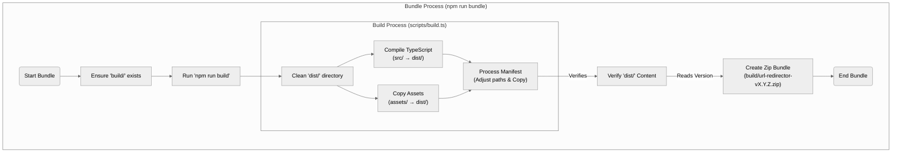

# Build System & Architecture

## Overview

The URL Redirector extension uses a composed build system where the bundle process builds upon the core build process. This ensures consistency and follows the DRY (Don't Repeat Yourself) principle.

## Architecture



### 1. Build Script (`scripts/build.ts`)

The `build` script is responsible for creating a complete, loadable extension in the `dist/` directory.

**Responsibilities:**
1.  **Clean**: Empties the `dist/` directory.
2.  **Compile**: Runs the TypeScript compiler (`tsc`) to transpile `.ts` files in `src/` to `.js` files in `dist/`.
3.  **Copy Assets**: Copies the `assets/` directory (containing `html`, `styles`, and `icons`) to `dist/`.
4.  **Manifest Adjustment**: Copies `manifest.json` to `dist/` and updates the `service_worker` path to point to the compiled JavaScript file (e.g., changing `dist/background.js` to `background.js` so it works from the root of the `dist/` folder).

**Output:**
A `dist/` folder containing the unpacked extension, ready to be loaded into Chrome via "Load unpacked".

### 2. Bundle Script (`scripts/bundle.ts`)

The `bundle` script packages the extension for publication to the Chrome Web Store. It **composes** with the build script rather than duplicating logic.

**Responsibilities:**
1.  **Ensure Build Directory**: Creates a `build/` directory if it doesn't exist.
2.  **Run Build**: Executes `npm run build` to ensure `dist/` is fresh and valid.
3.  **Verify**: Checks that `dist/` is not empty.
4.  **Package**: Zips the contents of `dist/` into `extension.zip`.

**Output:**
An `extension.zip` file (usually in the root or `build/` folder) ready for upload.

## Workflow

### Development
During development, you primarily use the build process:

```bash
npm run build
# or
npm run build:watch
```

Then load the `dist/` folder in Chrome.

### Release
When preparing a release:

```bash
npm run bundle
```

This command guarantees that what you zip is exactly what the build script produces, minimizing the risk of packaging inconsistencies.

## CI/CD Integration

The system is designed for easy CI integration:
1.  **Build**: `npm run build` verifies that the project compiles and assets are assembled correctly.
2.  **Test**: `npm test` (which includes build validation) ensures the output is valid.
3.  **Bundle**: `npm run bundle` creates the artifact for deployment.

See [Build Tests](build-tests.md) for details on how the build output is validated.
