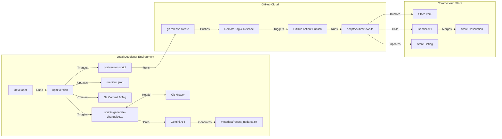

# Release Process

The release process is fully automated via **GitHub Actions**, triggered by creating a release tag locally using `npm version`.

## Prerequisites

- Ensure you are on the `main` branch and your working directory is clean.
- Ensure you have the `GEMINI_API_KEY` configured in Google Secret Manager (for AI changelogs).
- Ensure you have `gcloud` authenticated locally if you want to run dry runs (optional).

## Steps to Release

1.  **Bump Version & Trigger Release:**
    Run the standard npm version command. This is the **ONLY** command you need to run to ship a new version.

    ```bash
    npm version <patch|minor|major>
    # Example: npm version patch
    ```

    **What happens automatically:**
    1.  **AI Changelog Generation:** The `preversion` (or `version`) hook runs `scripts/generate-changelog.ts`, which uses Google Gemini to summarize recent commits into `metadata/recent_updates.txt`.
    2.  **Manifest Update:** Updates `manifest.json` version to match `package.json`.
    3.  **Git Commit & Tag:** Commits the changelog and manifest, and creates a git tag (e.g., `v1.2.1`).
    4.  **GitHub Release:** The `postversion` hook pushes the tag and creates a GitHub Release, attaching the built artifact (`url-redirector-vX.Y.Z.zip`) and using the AI-generated changelog as the release notes.
    5.  **CWS Submission (CI):** The creation of the GitHub Release triggers the **Publish Web Extension** workflow in GitHub Actions.
        *   This workflow bundles the extension (ensuring a hermetic build).
        *   It uploads and publishes the extension to the Chrome Web Store.
        *   It uses Gemini to intelligently merge the new changelog into the CWS Store Listing description (appending for patches, replacing for major/minor).

## Manual / Dry Run

To test the submission process or generate changelogs without publishing:

**Locally (Dry Run):**
```bash
npm run cws:submit
```
This runs a dry run, validating credentials (from GCP) and showing a preview of the AI-generated Store Description update in the console.

**Via GitHub Actions:**
1.  Go to the **Actions** tab on GitHub.
2.  Select **Publish Web Extension**.
3.  Click **Run workflow**.
4.  Ensure "Run in dry-run mode" is checked (it is by default).
5.  Run the workflow to see the build and description update preview in the logs.

## Architecture

