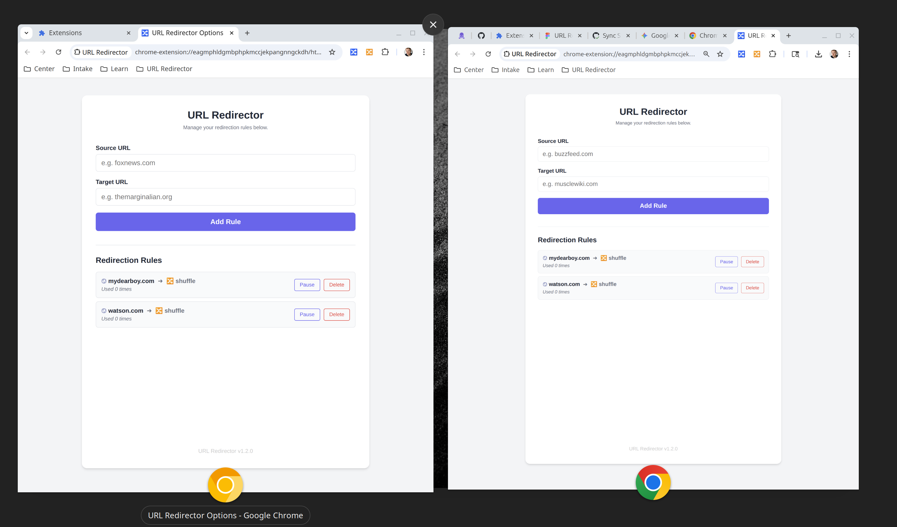

# Testing

This document provides an overview of the testing strategy for the URL Redirector Chrome extension, which follows the testing pyramid model.

## Testing Pyramid

Our testing strategy is divided into three layers:

### 1. Unit Tests (`/test/unit`)

- **Purpose**: To test individual functions or components in isolation.
- **Tools**: [Vitest](https://vitest.dev/)
- **Config**: [vitest.config.ts](https://vitest.dev/config/)
- **Scope**: These tests are fast and focused, verifying the correctness of business logic without external dependencies.

### 2. Integration Tests (`/test/integration`)

- **Purpose**: To test the interaction between different parts of the extension.
- **Tools**: [Vitest](https://vitest.dev/)
- **Config**: [vitest.config.ts](https://vitest.dev/config/)
- **Scope**: These tests ensure that different modules work together as expected, such as the popup and the storage module.

### 3. End-to-End (E2E) Tests (`/test/e2e`)

- **Purpose**: To test the complete user workflow from start to finish.
- **Tools**: [Playwright](https://playwright.dev/)
- **Config**: [playwright.config.js](https://playwright.dev/docs/test-configuration)
- **Scope**: These tests simulate real user interactions with the extension in a browser environment, ensuring the entire system works as intended.

## Running Tests

You can run the entire test suite or individual test types using the following `npm` commands:

- **Run all tests**: `npm test`
- **Run only unit tests**: `npm run test:unit`
- **Run only integration tests**: `npm run test:integration`
- **Run only E2E tests**: `npm run test:e2e`
- **Run only E2E tests and launch the Playwright UI**: `npm run test:e2e-ui`
- **Run all tests with coverage**: `npm run test:coverage`
- **Run unit and integration tests with coverage**: `npm run test:coverage-vitest`
- **Run only E2E tests with coverage**: `npm run test:coverage-e2e`

## Additional Notes

### Build Validation Tests

The build validation tests ensure that the `npm run build` command produces a complete, valid Chrome extension in the `dist/` folder with all necessary files and correct configurations.

### Test Coverage

The test suite validates multiple aspects of the auild output:

- **Required Files**: Validates that all essential files are present in the `dist/` folder.
- **Compiled JavaScript Files**: Ensures TypeScript compilation succeeded.
- **Icon Files**: Validates icon assets.
- **File Integrity**: Checks that files are properly linked.
- **Extension Completeness**: Validates the extension can be loaded in Chrome.
- **Build Reproducibility**: Ensures consistent build output.

## Testing Storage Sync

To test storage sync from a single device, you can use two separate Chrome profiles.

1.  Open Chrome with your primary profile.
2.  Open a second instance of Chrome with a different profile (or a Guest profile if testing local storage, but for sync you need two profiles signed into the same Google account with Sync enabled).
    - _Note: For development testing of `chrome.storage.sync`, you can often simulate this by using two different Chrome channels (e.g., Stable and Canary) signed into the same account. You can download [Chrome Canary here](https://www.google.com/chrome/canary/)._
3.  Load the unpacked extension in both instances.
4.  Open the Options page in both instances.
5.  Add a rule in the first instance.
6.  Verify that the rule appears in the second instance automatically (it may take a few seconds).

